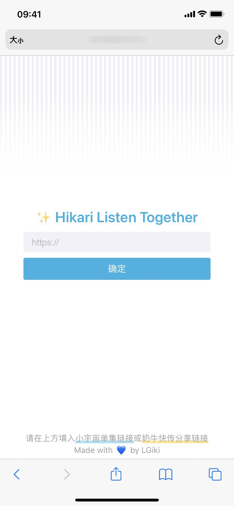
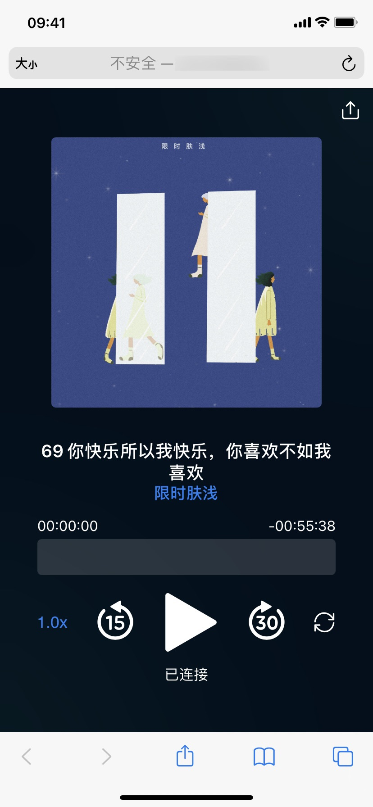

# ✨ Hikari Sync Player Frontend


一个用来和朋友远程一起听播客<del>、看视频</del>的在线工具。

目前**仅支持小宇宙单集链接**，例如：[https://www.xiaoyuzhoufm.com/episode/62545231abacbeddc37c5ce5](https://www.xiaoyuzhoufm.com/episode/62545231abacbeddc37c5ce5)

该项目为个人行为，与小宇宙无关。

# Screenshot

| 首页                              | 播放页                            |
| --------------------------------- | --------------------------------- |
|  |  |

# Deploy

- 根据[hikari-sync-player-backend](https://github.com/LGiki/hikari-sync-player-backend/tree/master)的[README](https://github.com/LGiki/hikari-sync-player-backend/blob/master/README.md)，部署后端程序
- 将前端部署到 Vercel 或自己的服务器上

## Deploy with Vercel

[](https://vercel.com/new/clone?repository-url=https%3A%2F%2Fgithub.com%2FLGiki%2Fhikari-sync-player-frontend&env=NEXT_PUBLIC_API_BASE_URL,NEXT_PUBLIC_WS_BASE_URL&envDescription=API%20URLs%20needed%20for%20the%20application.&envLink=https%3A%2F%2Fgithub.com%2FLGiki%2Fhikari-sync-player-frontend%23self-hosting&project-name=hikari-sync-player)

## Self-Hosting

1. ```bash
   git clone https://github.com/LGiki/hikari-sync-player-frontend.git
   cd hikari-sync-player-frontend
   # or npm install
   yarn install
   cp .env.template .env.local
   ```

2. 编辑.env.local 文件。其中各项参数的含义如下：

   - `NEXT_PUBLIC_API_BASE_URL`：API 的基础地址，默认值为：**http://localhost:12321/api/v1**

   - `NEXT_PUBLIC_WS_BASE_URL`：用于播放状态同步的 WebSocket 地址，默认值为：**ws://localhost:12321/api/v1/room/ws**

     注意：如果前端使用了 HTTPS，则 API 地址和 WebScoket 地址也必须相应地使用 HTTPS

   - `NEXT_PUBLIC_WEBSITE_TITLE`：网站标题，默认值为：**✨ Hikari Listen Together**

   - `NEXT_PUBLIC_ASSETS_BASE_URL`：资源文件的 URL 前缀，可以将[/public](/public)文件夹下的所有文件上传到 CDN，并将 CDN 的网址前缀填入该变量里，加快网站载入，默认值为**空**

3. ```bash
   next build
   next start
   ```

# TODOs

- [ ] 支持视频同步播放

# License

MIT License
